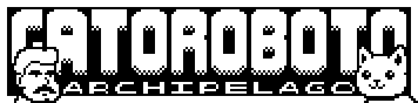

# Gato Roboto Archipelago

A bite-sized metroidvania platformer gets the Archipelago treatment!

## Required Software

⚠ *Only tested on **Windows 10** in English* ⚠

- Gato Roboto: [Steam Store](https://store.steampowered.com/app/916730)
- Archipelago: [Archipelago Releases Page](https://github.com/ArchipelagoMW/Archipelago/releases/latest)
- APWorld: [Releases Page](https://github.com/Ravenmist-Games/Gato-Roboto-APWorld/releases/latest)

## What does randomization do to this game?

Currently the randomizer supports item and event randomization. There are also options to include skips and/or sequence breaks, such as **Rocket Jumping**, to vary the logic.

The default goal is to **Defeat Gary**, which is identical to the vanilla experience. No other goals exist currently, but future plans include **All Cartridges** and **100%** as alternative and longer gameplay experiences.

## What items and locations get randomized?

By default, all of the following are randomized:
- Healthkits
- Cartridges
- Upgrade Modules
- Progressive Events (Aqueducts' Treadmills, Heater Core's Hotboys and Heater Tubes, Ventilation's Buttons)
- Rebba's Shop

## What other changes are made to the game?

A few QoL improvements have been made to the base game:
- The game runs on a single save file, separate from your base game save files.
- Starting a new game now places Kiki in the mech room, allowing the player immediate access to the mech suit.
- Warps have been added to the pause menu, allowing players to warp to any area they've previously been to.
- Tutorial dialogs (intro, swimming, mech, etc.) have been removed.
- All collectible item sprites have been replaced with the AP icon.
- WARNING: USE WITH CAUTION. Press F12 to enable/disable the debug menu in the pause menu rotation. Keys 1-9 can also be used to increment the debug menu options.

## Bug Reports & Feature Requests

For any bug reports and/or feature requests, please create a related [Issue](https://github.com/Ravenmist-Games/Gato-Roboto-APWorld/issues) and document it appropriately.

## Contributing

Please take a look at our [guide](/gatoroboto/docs/contributing.md) before making a contribution.
